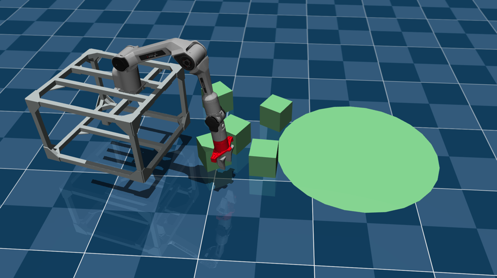
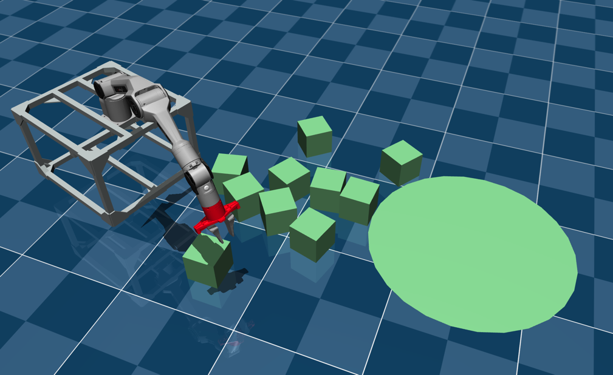

# Installation
You can install all the requirements by running (from the root of the `rl_l171_project` folder):
```bash
conda create -n rl_l171_310 python=3.10
conda activate rl_l171_310
pip install -e .
```

# File structure

Inside the rl_l171 folder, you will find the following files and directories:
- `gym_env.py` – Defines the main Gym environments you are going to train on. 
- `mujoco_env.py` – Implements the robot simulator class that interfaces with Mujoco. (You don’t need to read or modify this file.)
- `assets/` – Contains Mujoco XML files that define the robot and environment. (You don’t need to read these either.)
- `utils/` – Includes utility functions for the environment and simulator. (You don’t need to read these either.)

# CubesGymEnv
The gym environment is defined in `rl_l171/gym_env.py`. You can see a random policy interacting with the environment by running 
```bash
mjpython rl_l171/gym_env.py --render
```

You can initialise the environment as follows:

```python
from rl_l171.gym_env import CubesGymEnv

env = CubesGymEnv(
    render_mode=None,
    max_nr_steps=100,
    nr_cubes=5,
    randomise_initial_position=True,
    seed=5
)

```

The arguments are:
- `render_mode`: 1) `"human"` to visualise the environment.
                 2) `"rgb_array"` to get an RGB array as output (used e.g., to record a video).
                 3) `None` for no rendering.
- `max_nr_steps`: Maximum number of steps per episode.
- `nr_cubes`: Number of cubes in the environment. You should use **5 or 10** only!
- `randomise_initial_position`: Whether to randomise the initial position of the cubes and robot. It **MUST** be on!
- `seed`: Random seed for reproducibility. 

> Tip: Always train and test with several different seeds (at least 3). Do not base your conclusions on a single seed. If your algorithm fails on one seed, it does not mean it is not working at all!

>### !!!! IMPORTANT !!!!
>For the Cleanup5Cubes and Cleanup10Cubes tasks, initialise the environment (see command above) with:
>- `nr_cubes=5` for `Cleanup5Cubes`
>- `nr_cubes=10` for `Cleanup10Cubes`

The image below is an example of the `Cleanup5Cubes` environment. Please note that the cubes and robot positions are randomised at the start of each episode!


The image below is `Cleanup10Cubes`:



## Observation space
The observation space is a `gymnasium.spaces.Dict` with the following structure:
- `base_pose` (3 floats): [x, y, theta] of the mobile base.
- `arm_pos_global` (3 floats): [x, y, z] of the end-effector in the world frame.
- `arm_quat_global_wxyz` (4 floats): [w, x, y, z] orientation of the end-effector.
- `gripper_pos` (2 floats): Position of the two gripper joints.
- `cube_i_pos` (Box, shape 3): The [x, y, z] position of each of the N cubes.

The code is in `rl_l171/gym_env.py`, lines 56-64.

## Action space

The action is a 7-dimensional vector with the following structure:
[base_delta_x, base_delta_y, base_delta_theta, arm_delta_x, arm_delta_y, arm_delta_z, gripper_pos]
where:
- `base_delta_x, base_delta_y, base_delta_theta`: Deltas to apply to the mobile base pose.
- `arm_delta_x, arm_delta_y, arm_delta_z`: Deltas to apply to the end-effector position.
- `gripper_pos`: Target position for the two gripper joints (`0` being closed and `1` open).

The actions are deltas applied to the current target pose of the robot controllers.
The relevant code is in `rl_l171/gym_env.py`, lines 48-53.

## Reward 
The goal of the task is to move all cubes inside the green carpet centred at the origin (0, 0) in the 2D plane.
The reward is calculated as the negative mean 2D distance of all cubes to the origin.
```
reward = -np.mean(distance_of_each_cube_to_target)
```
If a cube is inside the target area, its distance is treated as 0.
This means once a cube is "solved" (at the origin), it no longer provides a negative penalty.
The episode does not terminate when all cubes are collected to encourage the agent to learn to keep the cubes in the target area.

The code is in `def _calculate_reward()` in `rl_l171/gym_env.py`

> We do not expect your solution to move *all* cubes to the target area perfectly, but rather to get them as close as possible within the episode length.
> We value algorithmic improvements more, with the reward being only one of the indicators of how good the method is.  

> Remember: do not change the reward unless absolutely necessary, as it may make results incomparable when marking!
> Run multiple episodes for evaluation since the initial positions of the robot and cubes are randomised.

